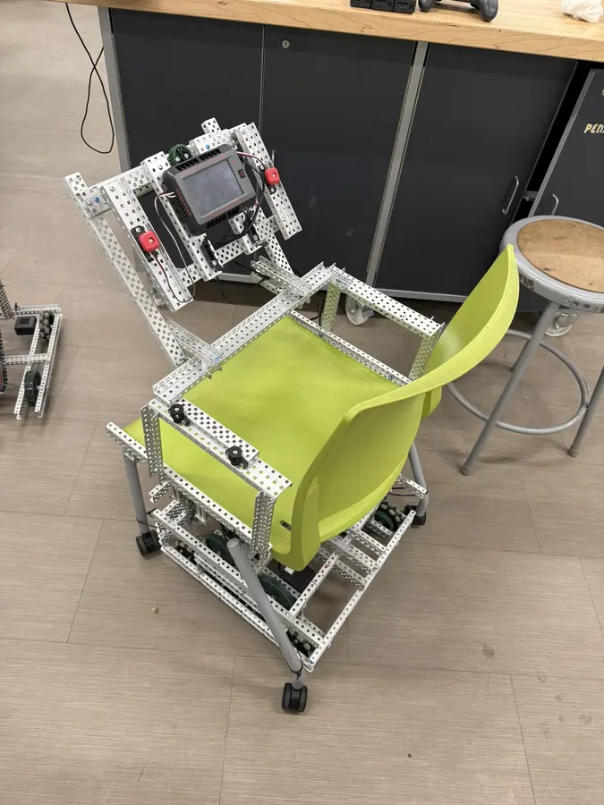

# The Chair

A school chair converted into a small differential-drive go-kart with VEX V5 hardware and Rust.


**[Stardance](https://stardance.hackclub.com/projects/4170)**



The Chair uses eight VEX V5 motors in two differential drivetrains. A steering wheel and Rotation Sensor provide direct controls, with an optional V5 Controller as a second input mode. Three V5 Brains run the Rust firmware: one reads controls and manages the dashboard, while the other two control and monitor four drive motors each.

## Videos

- [Driving from the seat](media/video/driving-pov.mp4)
- [Exterior driving test](media/video/driving-exterior.mp4)
- [Dashboard and controls](media/video/hud-demo.mp4)

## How it works


The master Brain reads the physical controls or V5 Controller, measures the steering-wheel position, calculates the LEFT and RIGHT motor targets, and displays system status. It sends the LEFT target through P19 and the RIGHT target through P20.

Each drivetrain Brain receives one side's target through P21, drives four motors on P4–P7, and returns motor, battery, fault and speed telemetry. The top and bottom motors use opposite software polarity because their gears face opposite directions.

Messages use Postcard, COBS framing and CRC-32. Startup handshakes assign each side and session. Sequence checks, health deadlines and a 150 ms command lease stop stale or disconnected nodes from continuing to drive.

## Controls

In **WHEEL** mode, P17 controls forward and reverse speed in 10% steps. The left wheel button on ADI A must be held to drive. The steering wheel has a 10° deadzone and reaches full steering at ±80°. Steering still works with P17 at zero, allowing the chair to turn in place. Full right steering requests `LEFT=1, RIGHT=-1`; full left requests `LEFT=-1, RIGHT=1`.

In **CONTROLLER** mode, left stick Y controls speed and direction while right stick X controls steering. Centering both sticks coasts without disarming. Controller A arms, L1 parks, and B latches the E-stop. P17 is ignored in this mode, and controller loss stops the chair instead of falling back to WHEEL mode.

The display provides CENTER, ARM, PARK and MODE controls. The right wheel button on ADI B is a latched rider E-stop in both modes. Faults remain latched until all three programs restart.

## Build progress

- [x] Build and mount the eight-motor drivetrain.
- [x] Reinforce the chair frame and steering assembly.
- [x] Install three Brains, two batteries and rider controls.
- [x] Implement steering feedback and both driving modes.
- [x] Implement serial communication, telemetry, HUD and fault handling.
- [x] Drive the completed chair with a rider.
- [ ] Diagnose the intermittent shared-power reset seen with unevenly charged batteries.
- [ ] Finish the unloaded commissioning and fault-injection checklist.
- [ ] Measure final loaded stopping distance.

Autonomous driving is not implemented.

## Reproduce it

### Hardware and CAD

**Hardware list and BOM: TBD.** I will publish the final BOM after the hardware design is finished. The CAD files also need to be redone before they are ready as complete reproduction files.

The first step is 3D-printing the chair mounting bracket, which provides a flat connection between the angled seat base and the VEX frame. Current scans, bracket files and drivetrain calculations are under [`hardware/`](hardware/) as working references only.

### Port map

| Brain | Port | Connection |
| --- | --- | --- |
| Master | P17 | Rotation Sensor throttle |
| Master | P18 | Optional V5 radio |
| Master | P19 | Serial link to LEFT P21 |
| Master | P20 | Serial link to RIGHT P21 |
| Master | P21 | Steering feedback motor |
| Master | ADI A | Hold-to-run / rider brake button |
| Master | ADI B | Latched rider E-stop |
| LEFT | P4–P7 | Four LEFT drive motors |
| RIGHT | P4–P7 | Four RIGHT drive motors |

P21 has a different purpose on each Brain: it connects to the steering motor on the master and carries serial data on each drivetrain Brain. See the complete [wiring guide](docs/WIRING.md) before connecting anything.

### Software

The Nix shell contains the pinned Rust, cargo-v5, rustfmt, Clippy and mdBook environment.

```sh
nix develop
./check.sh
./upload.sh controller left right
```

`check.sh` runs formatting, tests, Clippy, RustSec, all three firmware builds, shell checks and the documentation book. Upload slots are master `1`, LEFT `2` and RIGHT `3`. Uploading does not start the programs.

## Safety

The chair weighs about 36 lb. I weigh about 140 lb; it supports me and can reach its configured top speed of about 3.57 mph after accelerating. This is still an experimental ride-on robot, not a road vehicle.

Test changes with the drive wheels raised before testing on the floor. Check motor direction, steering direction, E-stop behavior, motor temperature and stopping distance before carrying anyone else. Use a clear area and a spotter, keep hands and clothing away from the gears, and do not treat software stopping as a mechanical brake or independent power disconnect.

## Documentation

- [Wiring and ports](docs/WIRING.md)
- [Operator guide](docs/OPERATING.md)
- [Dashboard reference](docs/HUD.md)
- [Control and safety design](docs/SAFETY.md)
- [Commissioning checklist](docs/COMMISSIONING.md)
- [Development and toolchain](docs/DEVELOPMENT.md)

## Repository

Firmware is under `crates/`, working CAD and calculations are under `hardware/`, media is under `media/`, and the detailed field guide is under `docs/`.

## License

MIT. See [LICENSE](LICENSE).
