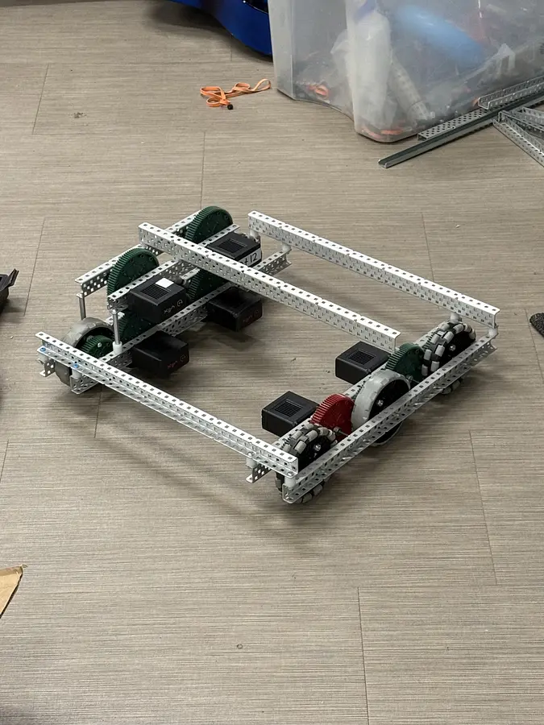
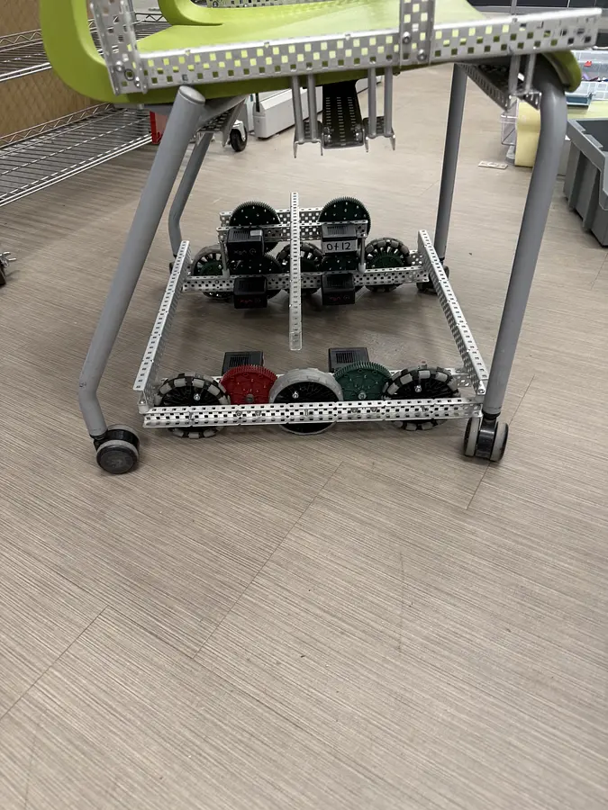
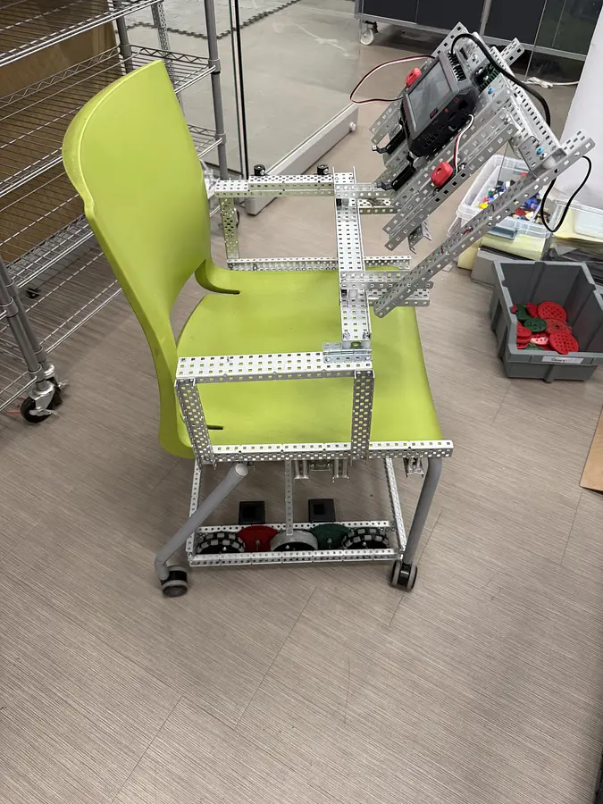

# The Chair

A school chair converted into a small differential-drive go-kart with VEX V5 hardware and Rust.


**[Watch the 13-second driving demo](media/video/driving-demo.mp4)** · **[Read the Stardance devlogs](https://stardance.hackclub.com/projects/4170)**

The physical drivetrain has been assembled and driven. The current code is a safer three-Brain redesign of the simple one-Brain program used for the demo. It adds steering feedback, two-button throttle, motor and battery telemetry, link timeouts, and a latched emergency stop. This design still needs full on-chair integration testing; autonomous driving is not implemented yet.

## How it works

The chair uses eight 200 RPM motors, four per side, as a differential drivetrain. A motor coupled to the steering wheel acts as both an angle sensor and a resistive return-to-center mechanism.

| V5 Brain | Program | Role |
| --- | --- | --- |
| Controller | `chair-controller` | Reads steering and throttle, mixes left/right voltage, displays status, coordinates safety |
| Left drive | `chair-left` | Runs four left motors and hosts gear, speed, and E-stop controls |
| Right drive | `chair-right` | Runs four right motors |

The Brains exchange framed serial messages encoded with Postcard and COBS plus CRC-32. Each drive node brakes if commands stop for 250 ms. Missing health replies, unsafe battery telemetry, motor faults, link errors, or a local E-stop latch the whole system off until reboot.

## Build progress

- [x] Scan and model the chair and mounting bracket
- [x] Build the eight-motor drivetrain and mount it under the seat
- [x] Prove the drivetrain can move the chair
- [x] Implement steering feedback and steering/throttle mixing
- [x] Implement the three-Brain protocol, telemetry, HUD, and fail-safe behavior
- [ ] Install and test the three-Brain electronics on the chair
- [ ] Tune steering geometry and force feedback on hardware
- [ ] Validate every emergency-stop path with the wheels raised
- [ ] Add autonomous sensing and control

The linked Stardance project records 23 hours across nine devlogs and was marked a Super Star project.

## Progress photos

| Eight-motor chassis | Fit check under chair | Mounted drivetrain |
| --- | --- | --- |
|  |  |  |

## Reproduce it

### Hardware

- SitOnIt Rio 2 four-leg armless chair, or a similar chair with a rigid four-bolt seat base
- 3 VEX V5 Brains and batteries
- 8 VEX V5 Smart Motors with green 200 RPM cartridges
- 4-inch drive wheels
- 72-tooth motor gears and 48-tooth wheel gears (1.5:1 speed increase)
- 1 additional V5 motor with a blue cartridge for steering feedback
- 2 momentary switches for the two-button throttle interlock
- 1 active-high emergency-stop switch and 2 legacy potentiometers for gear and speed
- Structure, bearings, shafts, fasteners, wiring, and a printed mounting bracket

The editable models, scans, bracket files, and drivetrain calculation spreadsheet are under [`hardware/`](hardware/). Start with [`Mounting Bracket.3mf`](hardware/cad/mounting-bracket/Mounting%20Bracket.3mf), then adjust the bracket and frame to fit your exact chair. Do not assume the supplied chair scan is dimensionally exact.

### Port map

| Brain | Port | Connection |
| --- | --- | --- |
| Controller | Smart 1 | Steering feedback motor |
| Controller | Smart 2 | Serial link to left Brain smart port 2 |
| Controller | Smart 3 | Serial link to right Brain smart port 2 |
| Controller | ADI A + B | Two throttle switches; both must be active |
| Left | Smart 3–6 | Four left drive motors |
| Left | ADI C | Active-high emergency stop |
| Left | ADI D | Reverse/park/drive potentiometer |
| Left | ADI E | Maximum-speed potentiometer |
| Right | Smart 3–6 | Four right drive motors |

Confirm the inter-Brain serial wiring against current VEX electrical guidance before powering it. Raise all drive wheels for first tests.

### Software

The reproducible Nix shell includes Rust, `cargo-v5`, `rustfmt`, Clippy, and mdBook:

```sh
nix develop
cargo test --workspace
cargo v5 build --path crates/controller
cargo v5 build --path crates/left
cargo v5 build --path crates/right
```

Connect each Brain in turn, then upload all programs:

```sh
./upload.sh controller left right
```

Programs use slots 1, 2, and 3 respectively. See [`docs/`](docs/) for control and safety details.

## Repository map

| Path | Contents |
| --- | --- |
| `crates/controller/` | Driver controls, steering model, HUD, and master logic |
| `crates/left/`, `crates/right/` | Per-side drive programs |
| `crates/shared/` | Serial protocol, telemetry, drivetrain, and safety logic |
| `hardware/` | CAD, scans, bracket, and drivetrain calculations |
| `media/` | Build photos and driving demo |
| `docs/` | Detailed hardware and software notes |

## Safety

This is an experimental ride-on robot, not a road vehicle. Use a physical emergency stop, current protection, guards, a clear test area, and a spotter. Test with the wheels off the ground first. Do not ride it until braking, link-loss behavior, mechanical retention, and load limits have been independently verified.

## License

MIT. See [`LICENSE`](LICENSE).
