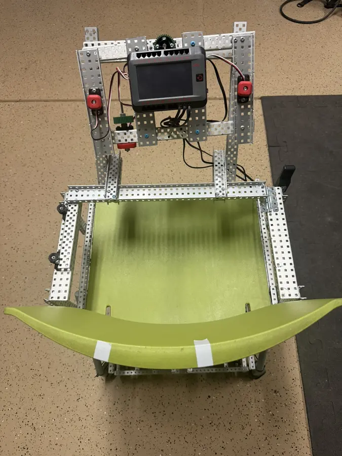
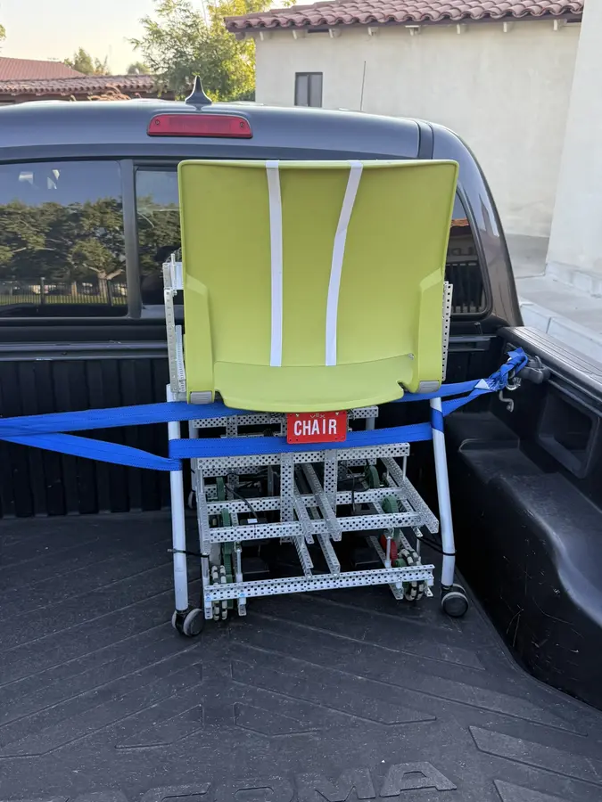

# The Chair

A school chair converted into a small differential-drive go-kart with VEX V5 hardware and Rust.


**[Watch the 13-second driving demo](media/video/driving-demo.mp4)** · **[Read the Stardance devlogs](https://stardance.hackclub.com/projects/4170)**

[](https://www.rust-lang.org/)
[](https://www.vexrobotics.com/v5)
[](https://vexide.dev/)
[](LICENSE)
[](https://stardance.hackclub.com/projects/4170)


What began as an old SitOnIt Rio 2 classroom chair is now a rideable robotics demonstrator: eight drive motors, a physical steering wheel, three cooperating V5 Brains, live telemetry and two driving modes. The current Rust firmware replaces the early one-Brain demo program with supervised drivetrain nodes, steering feedback, framed communication and latched fault handling.

Built by [@eli_ozcan](https://stardance.hackclub.com/@eli_ozcan) for GMHS Robotics. The [Stardance build log](https://stardance.hackclub.com/projects/4170) records **12 devlogs and 34 hours**, and was named a **Super Star Project**.

## Highlights

- Eight green-cartridge V5 motors split across mirrored four-motor drivetrains.
- Physical steering wheel with encoder feedback and limited spring/damper resistance.
- Rotation Sensor throttle in signed 10% steps, plus optional V5 Controller driving.
- In-place turning in either mode; full physical-wheel steering requests full opposite side power.
- Live speed estimate, throttle, steering, battery, temperature, fault and link telemetry.
- Three-Brain serial protocol with handshake, side assignment, CRC, retries, sequence/session validation and command leases.
- Fail-closed stops for E-stop, controller/link loss, stale telemetry, temperature, malformed traffic and loop stalls.

| System | Current configuration |
| --- | --- |
| Compute | 1 master Brain + LEFT and RIGHT drivetrain Brains |
| Drive | 8 V5 Smart Motors, 4 per side |
| Gearing | 72:48 external ratio; wheel turns 1.5× per motor turn |
| Wheels | 4 in configured diameter |
| Top speed | About 3.57 mph theoretical at 200 motor RPM |
| Steering | Blue-cartridge motor/encoder, 10° deadzone, full at ±80° |
| Firmware | Rust 2024, [vexide](https://vexide.dev/), pinned Nix toolchain |

The speed figure is encoder-derived from configured geometry, not verified ground speed.

## How it works


| V5 Brain | Program | Role |
| --- | --- | --- |
| Steering-wheel master | `chair-controller` | Reads controls, mixes LEFT/RIGHT targets, runs steering feedback and HUD, coordinates safety |
| LEFT drive | `chair-left` | Runs four LEFT motors, enforces local safety and reports telemetry |
| RIGHT drive | `chair-right` | Runs four RIGHT motors, enforces local safety and reports telemetry |

Master P19 connects to LEFT P21; master P20 connects to RIGHT P21. The Brains exchange Postcard messages framed with COBS and protected by CRC-32. Each child owns a 150 ms command lease and stops locally if commands expire. Missing health, unsafe telemetry, motor faults or protocol errors latch the complete system off until restart.

Top and bottom motor pairs use opposite software polarity because they are gear-coupled in opposite orientations. Confirm every direction with the wheels raised before ground testing.

## Controls

| Action | WHEEL | CONTROLLER |
| --- | --- | --- |
| Speed / direction | P17 signed throttle in 10% steps | Left stick Y |
| Steering | Physical wheel; 10° deadzone, full at ±80° | Right stick X |
| Arm | Display ARM or controller A | Display ARM or controller A |
| Enable | Hold left wheel button (ADI A) | No held button |
| In-place turn | Center P17, hold ADI A, turn wheel | Center left stick, move right stick |
| Coast stop | Release ADI A; remains armed | Center both sticks; remains armed |
| Park | Display PARK | L1 or display PARK |
| Latched E-stop | Right wheel button (ADI B) | Rider right button or controller B |

At full physical-wheel steering, WHEEL mode requests `LEFT=1, RIGHT=-1` for a right pivot and `LEFT=-1, RIGHT=1` for a left pivot. P17 is ignored in CONTROLLER mode. There is no automatic radio fallback.

## Build progress

- [x] Scan and model the chair and mounting bracket.
- [x] Build the eight-motor drivetrain and mount it below the seat.
- [x] Reinforce the frame and test the structure with roughly 160 lb.
- [x] Install the three Brains, dual drivetrain batteries, steering assembly and rider controls.
- [x] Implement steering feedback, throttle, controller mode, protocol, telemetry and HUD.
- [x] Demonstrate occupied low-speed driving.
- [ ] Resolve or electrically explain the intermittent shared-power event.
- [ ] Complete every unloaded commissioning and fault-injection test.
- [ ] Measure loaded stopping distance and validate final steering geometry.
- [ ] Add an independently reviewed all-drive power cut and physical braking strategy.

Autonomous sensing and driving are not implemented.

## Photos

### Finished build

| Master controls | Complete assembly | Ready for transport |
| --- | --- | --- |
|  |  |  |

### Earlier construction

| Eight-motor chassis | Fit check below chair | Mounted drivetrain |
| --- | --- | --- |
|  |  |  |

More photos and videos are preserved in [`media/`](media/) and the [full project devlog](https://stardance.hackclub.com/projects/4170).

## Reproduce it

### Hardware

- SitOnIt Rio 2 four-leg armless chair, or a similar rigid four-bolt seat base.
- 3 VEX V5 Brains and 2 drivetrain batteries.
- 8 V5 Smart Motors with green 200 RPM cartridges.
- 4 in drive wheels, 72-tooth motor gears and 48-tooth wheel gears.
- 1 V5 motor with a blue cartridge for steering feedback.
- 1 Rotation Sensor for signed throttle.
- 2 active-high rider buttons: hold-to-run and latched E-stop.
- VEX structure, bearings, shafts, fasteners, Smart Cables and printed mounting bracket.

Editable models, scans, bracket files and drivetrain calculations live under [`hardware/`](hardware/). Start with [`Mounting Bracket.3mf`](hardware/cad/mounting-bracket/Mounting%20Bracket.3mf), then fit the bracket and frame to the actual chair. Do not assume the supplied scan is dimensionally exact.

### Port map

| Brain | Port | Connection |
| --- | --- | --- |
| Master | P17 | Rotation Sensor throttle |
| Master | P18 | Optional V5 radio |
| Master | P19 | Serial link to LEFT P21 |
| Master | P20 | Serial link to RIGHT P21 |
| Master | P21 | Steering feedback motor |
| Master | ADI A | Hold-to-run / rider brake button |
| Master | ADI B | Latched rider E-stop |
| LEFT | P4–P7 | Four LEFT drive motors |
| RIGHT | P4–P7 | Four RIGHT drive motors |

P21 is role-dependent: it is the steering motor port on the master and the serial uplink on each child. See the complete [wiring guide](docs/WIRING.md) before powering hardware.

### Build and upload

```sh
nix develop
./check.sh
./upload.sh controller left right
```

`check.sh` runs formatting, host tests, Clippy, RustSec, all three V5 firmware builds, shell checks and the documentation book. Upload slots are master `1`, LEFT `2`, RIGHT `3`; upload does not start programs.

The environment pins Rust `nightly-2026-09-04`, cargo-v5 `0.12.1` and vexide [`403c4f9`](https://github.com/vexide/vexide/commit/403c4f92a94b88d878767ee0d778c0e689af6361). See [development notes](docs/DEVELOPMENT.md) for target details.

## Safety and current status

This is an experimental ride-on robot, not a road vehicle. The Stardance log documents completed hardware, occupied low-speed driving and a structure tested with roughly 160 lb. That is build evidence, **not engineering certification**.

**Software checks pass; occupied operation of this exact revision is not formally validated.** Before carrying a person, complete [commissioning](docs/COMMISSIONING.md), verify motor direction and gearing, measure loaded stopping distance, confirm steering travel, and provide an independently reviewed means to cut drive power.

One intermittent power event remains under investigation: with two low, unevenly charged drivetrain batteries, the master showed a white screen while one drivetrain Brain powered off. Fresh batteries stopped the symptom, but the shared Smart Cable power arrangement remains unverified. Do not treat failure to reproduce it as a fix; see [software and power limitations](docs/SAFETY.md).

## Field guide

| Need | Guide |
| --- | --- |
| Connect Brains, motors and controls | [Wiring](docs/WIRING.md) |
| Start, arm, drive and stop | [Operator guide](docs/OPERATING.md) |
| Read the screens or troubleshoot arming | [Dashboard](docs/HUD.md) |
| Understand control, limits and stop behavior | [Software design](docs/SAFETY.md) |
| Validate the finished chair | [Commissioning](docs/COMMISSIONING.md) |
| Build, test and modify firmware | [Development](docs/DEVELOPMENT.md) |

## Repository map

| Path | Contents |
| --- | --- |
| `crates/controller/` | Driver controls, steering feedback, HUD and master logic |
| `crates/left/`, `crates/right/` | Per-side drivetrain firmware |
| `crates/shared/` | Serial protocol, telemetry, drivetrain and safety logic |
| `hardware/` | CAD, scans, bracket and drivetrain calculations |
| `media/` | Build photos and driving demo |
| `docs/` | Field guide, diagrams and commissioning procedure |

## License

MIT. See [LICENSE](LICENSE).
