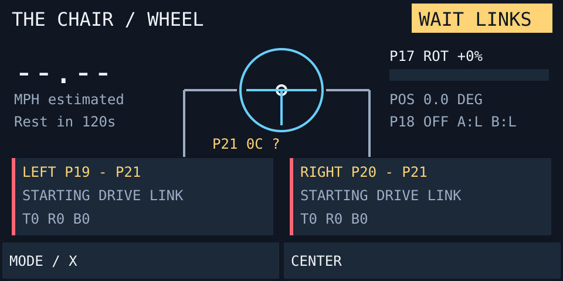
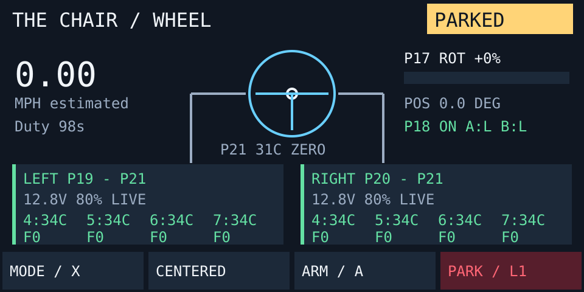
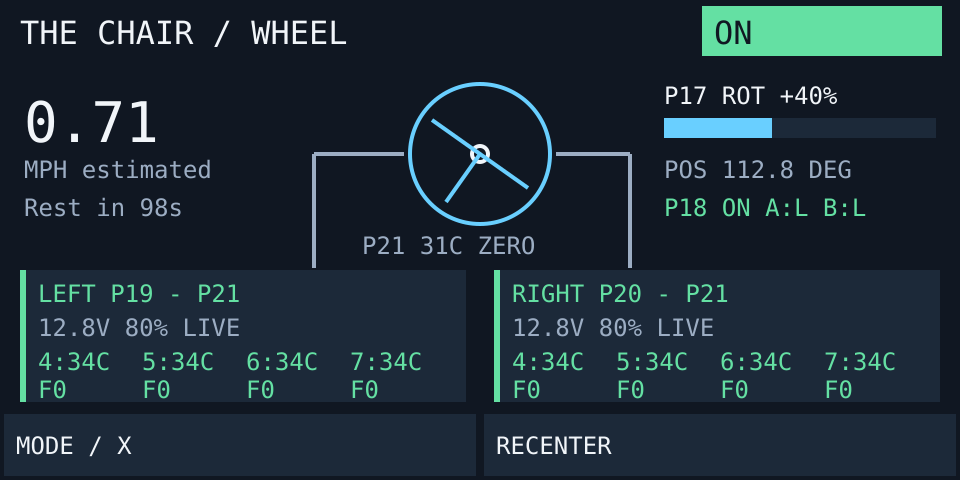
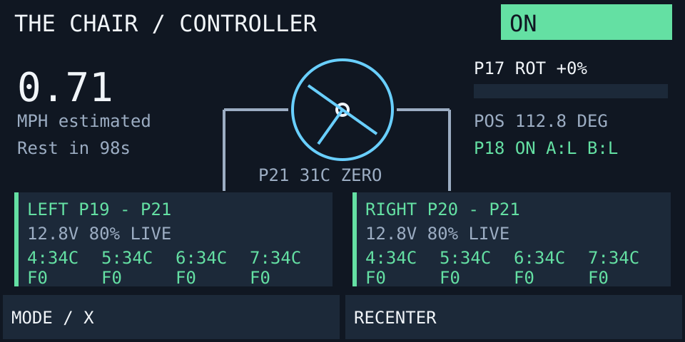
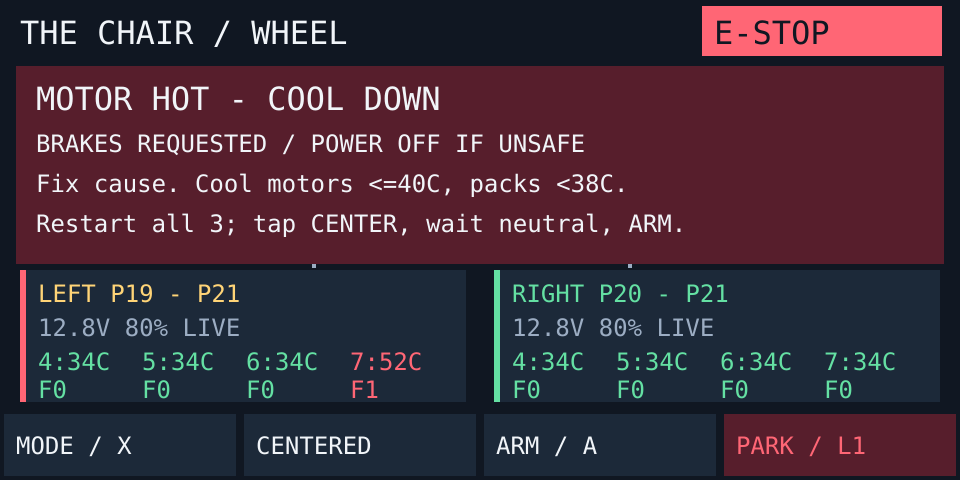
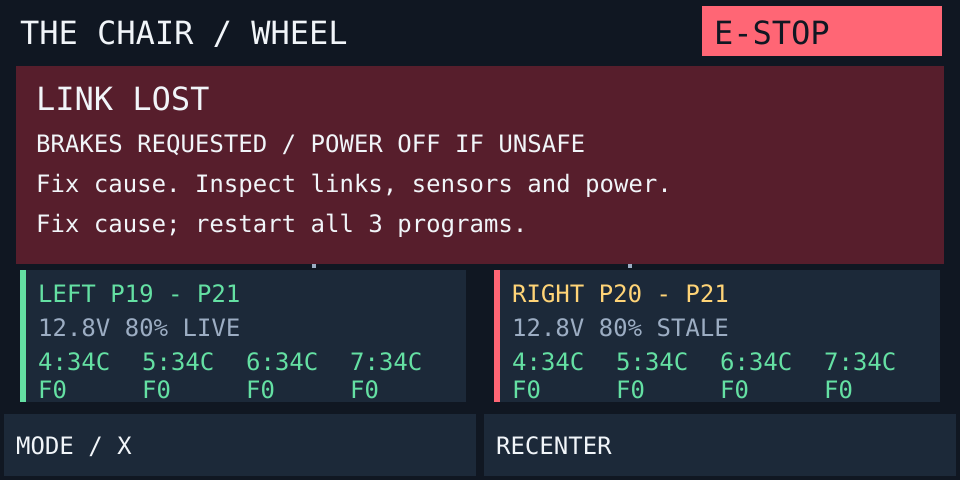

# Reading the dashboard

These six 480×240 scenes are **synthetic fixtures generated by the firmware's own `draw` function** in `crates/controller/src/hud.rs`, displayed at twice their native size. Geometry, labels and colors share the firmware renderer; host fonts and strokes approximate the physical screen. They are not live measurements or photos of a Brain.

## Waiting for the chair

The master waits for both children. `SYNCING (TAP RETRY)` means the Smart Port is configured but no valid protocol ACK has arrived; merely seeing a Generic Serial device in the Brain device list does not prove handshake. The next line shows cumulative `T` transmitted bytes, `R` received bytes and `B` malformed frames. Tap the LEFT or RIGHT telemetry card to clear that link's receive buffer and restart its handshake immediately; automatic SYN retries continue every 250 ms regardless. Confirm P19/LEFT-to-P21 and P20/RIGHT-to-P21, then start both child programs. `CONNECTED; WAIT PEER` means that side ACKed while the other side has not; no health request, command lease, battery read or motor discovery starts in this state. After both ACK, the master clears residual startup traffic, sends zero to both, then enables health requests. `CONNECTED; WAIT HEALTH` means this activation completed but health has not arrived. Startup partial frames are discarded while motors remain braked. No steering-wheel removal or automatic controller takeover is supported.

Each drivetrain Brain also displays its assigned side, `INITIALIZING MOTORS`, `WAITING FOR MASTER SYN`, `ACK SENT / WAIT ZERO`, `LINK ACTIVE` or its fault; P21 RX/TX byte totals; malformed-frame count; accepted sequence; requested/applied voltage; and per-motor temperature plus fault bits for P4–P7. Temperature never disappears when a fault bit exists: each entry uses `40C/F2` form, including `F0` when clear. P4/P5 are the bottom pair; P6/P7 are the top pair and use opposite polarity. Link handshake and its first zero command happen before motor polling. During discovery, missing telemetry displays `--C/F--`. `F2`, `F4`, `F8` and their combinations are current/driver warnings; they remain yellow diagnostics and do not stop motion. Every unknown bit remains fatal, while over-temperature receives its dedicated thermal stop. Finite RPM remains displayed and used for speed control but never latches a fault. The child probes one motor per iteration and all four must provide valid, cool telemetry continuously for 300 ms. Only then does normal runtime health supervision begin. Protocol v5 direction-tags frames because V5 generic serial can echo local TX into RX; valid self-echo is discarded and no longer increments `BAD`. A locally faulted child still ACKs and reports health, but never accepts drive commands. With programs running, Master TX increasing but child RX staying zero identifies a physical or VEXos transport path problem. Child RX increasing with child TX zero identifies rejected incoming frames. Child TX increasing with Master RX zero identifies the return path.

`ADI-B HIGH` means physical ADI B is pressed. This is not controller button B. Firmware uses the raw levels shown by VEXos Device Viewer for this chair: **LOW is released; HIGH is pressed**. Current levels remain visible beside the radio status as `A:L B:L` when released. B HIGH and controller B latch E-stop in every state, including startup. CENTER shows `CENTER: ADI-B` and remains blocked until B is LOW; local CENTER calibration and MODE selection remain available while drive motors initialize. CENTER prints either `[CENTER] OK` or an exact `[CENTER] BLOCKED` reason to the Master terminal. A moving, hot or temporarily unavailable steering sensor rejects CENTER without latching a fault.

## Parked

**PARKED** means fresh, valid links and a disarmed control state. It does not mean every ARM condition has passed: calibration, neutral dwell, temperatures and wheel position are checked separately. **ZERO** means a manual encoder center has been set; it does not verify mechanical alignment.

## Driving in WHEEL

| Display area | Meaning |
| --- | --- |
| WHEEL / CONTROLLER | Selected input source |
| ARMED / PARKED / SETUP / WAIT LINKS / E-STOP | State badge; fault takes priority, then armed, motor setup and link readiness |
| MPH estimated | Encoder-derived speed using configured wheel size and gearing |
| Duty | Master's remaining cumulative drive budget; children enforce their own budgets |
| Wheel drawing | Measured physical steering position, not controller stick position |
| P21 temperature / ZERO | Steering motor temperature and manual center status |
| P17 ROT / POS | Rotation Sensor throttle percentage and position in degrees; ADI C is unused |
| P18 RADIO | VEX controller connection status |
| LEFT P19–P21 / RIGHT P20–P21 | Master-to-child link identity |
| V / % / `LIVE` or `STALE`; `NO PACK` | Last child battery voltage, capacity and freshness; an all-zero SDK tuple denotes no locally attached pack |
| 4, 5, 6, 7 | Individual motor temperatures and fault bits, always shown together |

The master Display and touchscreen run in their own vexide async task. It samples the cumulative touch press counter every 16.7 ms, preserves pending actions until the control loop consumes them, and renders at most once per 100 ms using double buffering. The control loop only publishes a copied display view; it never performs screen drawing. Each drivetrain Display likewise runs in a separate async task at 250 ms cadence. Nominal control remains 10 ms; display cadence is not the control deadline. MPH averages the two four-motor RPM averages and applies the configured wheel/gearing conversion. It is not commanded speed or measured ground speed. Brief stops do not replenish Duty.

## Driving in CONTROLLER

The title changes to **CONTROLLER**. P17 ROT still describes the physical Rotation Sensor, so zero there with nonzero MPH is expected when the controller drives. Controller throttle or stick position is not drawn. The wheel drawing remains the measured encoder position while the steering motor follows the requested steering target.

## Fault display

A stop overlay gives the first latched reason. This fixture reports **52°C and F1 at LEFT P7**, matching `MOTOR HOT - COOL DOWN`. The overlay covers speed, throttle status and steering; telemetry cards and bottom controls remain visible. Visible controls cannot clear a fault.

Stop testing, record the reason, investigate, then restart all three programs after repair. Releasing the physical button, reconnecting a cable or cooling alone cannot reset the latch. Use the [fault-message index](FAULTS.md) for checks; the first reason may not identify every failed component.

## Stale telemetry

At ages above **600 ms**, a node card shows `STALE`, its left edge turns red and its heading turns yellow. Last battery and motor values remain visible; individual temperatures may still be green. Healthy updates show the stable label `LIVE` instead of a flickering millisecond counter.

Missing health or age above 600 ms on either side replaces speed with `--.--`; a fault overlay covers that area. The display rule does not extend the **500 ms pending-health deadline** or 150 ms child command lease. Master readiness requires health younger than 600 ms. See [link supervision](SAFETY.md#link-supervision).

## When ARM does nothing

Check these in order:

1. Both child programs are connected and reporting valid, fresh health.
2. Both sticks are centered, and enable/brake/E-stop buttons are released.
3. All motors have stopped; wait at least 500 ms with controls neutral.
4. Batteries and motors are below restart temperature thresholds.
5. The wheel has been manually centered with CENTER and is near that center.
6. CONTROLLER mode has a connected controller.
7. No fault is latched. If one is, follow the displayed reason and [commissioning procedure](COMMISSIONING.md).

CENTER and ARM are touchscreen controls on the master Brain; neither requires a handheld controller in WHEEL mode. Hold the steering wheel straight, put the P17 throttle at mechanical minimum, and tap CENTER to define both zero positions. After 500 ms neutral, tap ARM. Do not use CENTER to hide incorrect alignment.

## Touch controls

| Bottom-row label | Action and conditions |
| --- | --- |
| MODE / X | While armed, parks first. While parked, switches immediately; CONTROLLER needs a connection. Arming still requires stopped-neutral dwell. |
| CENTER | Zeros local steering and P17 throttle while disarmed, with both ADI buttons released and no fault; drive-link readiness is not required. |
| ARM / A | Arms only after all interlocks pass; drive enable must then be pressed. |
| PARK / L1 | Coasts and disarms. Latched faults still request Brake. |

A new touch press selects one action; holding or sliding a finger does not repeat it. Labels remain visible regardless of eligibility. Rider E-stop remains the right physical button and does not require a responsive touchscreen.

The connected controller also receives mode/state or fault-label text at most once per second, with a rumble request on faults. This is separate from the Brain dashboard.
