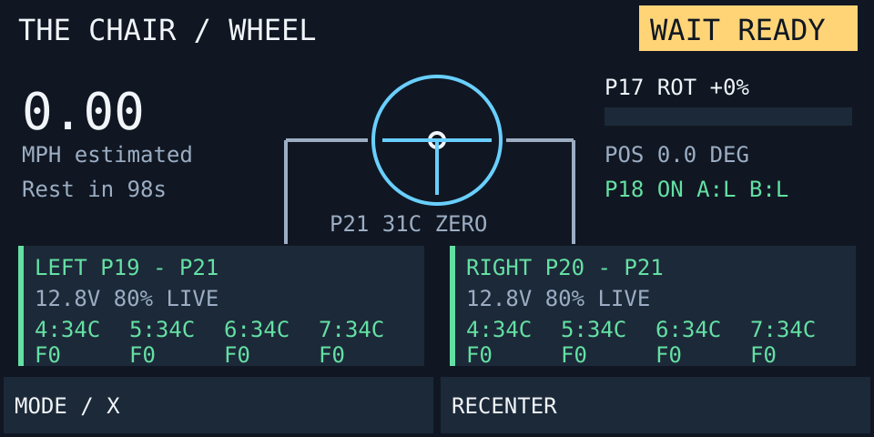

# Reading the dashboard

These pictures come from the Brain's drawing code. Their numbers are examples, not live readings.

## Connecting

**WAIT LINKS** means the drive Brains are connecting. **SETUP** means a Brain is checking its motors. **WAIT READY** means it is waiting for the chair to stop, controls to return to neutral, calibration, or a cool enough battery. When all checks pass for half a second, the status becomes **ON** automatically. **WAIT NEUTRAL** appears after B, L1 or a mode change until controls return to neutral and the chair stops.

Missing Brain after 60 seconds or missing motor after 5 seconds of discovery causes a latched E-STOP. Fix the cause and restart all three programs.

## Driving

| On screen | Meaning |
| --- | --- |
| **WHEEL / CONTROLLER** | Which controls drive the chair |
| **ON** | Ready to respond to driving controls |
| **WAIT NEUTRAL** | Waiting for a full stop and half a second of neutral controls after a brake or mode change |
| **BRAKING** | A B button is held; electrical Brake is requested on both sides |
| **MPH estimated** | Estimate from motor encoders and assumed gearing; not measured ground speed |
| **HOT** | A motor is warm; power reduces automatically |
| **REST ADVISED** | Suggested pause after 120 seconds of driving; no lockout |
| **LEFT / RIGHT** | Each drive Brain's connection, battery, motor and temperature readings |
| **A:L B:L** | Both rider buttons read LOW (released) |

A hot motor appears as a small yellow warning without covering speed, controls or motor readings. Drive power reduces from 50°C to 60°C and returns as the motor cools. The rest reminder clears after a full minute at rest.

## Controller mode

P17's physical position is still shown, but it does not control the motors in CONTROLLER mode. The wheel drawing shows measured steering position. The hand controller shows the mode, **B BRAKE: HOLDING**, or **MOTOR HOT: LIMITED**.

## E-STOP and old readings

A red **E-STOP** overlay shows the first serious health or control fault. The chair requests electrical Brake and cannot drive again until the cause is fixed and all three programs restart. B, hot motor and rest reminders do not cause this overlay.

**STALE** marks an old drive-Brain reading. It remains visible for diagnosis but cannot make the chair ready. Speed shows dashes if readings are missing or old. See [fault messages](FAULTS.md).

## When it does not become ON

1. Check all three programs are running and LEFT and RIGHT show live readings.
2. Release both B buttons and the left rider button. Center the controller sticks and put P17 at its neutral detent.
3. Let the motors stop and keep controls neutral for half a second.
4. Check that the steering wheel was physically centered at startup. Tap **RECENTER** only while stopped if its zero is wrong.
5. In CONTROLLER mode, check the controller connection. Drive batteries must be below 38°C before the chair becomes ON.
6. If **E-STOP** appears, follow [fault recovery](FAULTS.md).

## Touch buttons

| Button | What it does |
| --- | --- |
| **MODE / X** | Switches mode when stopped with neutral controls |
| **RECENTER** | Sets steering-wheel and P17 zero while stopped |

The B brake works independently of touchscreen response. Electrical Brake is not a mechanical brake.
