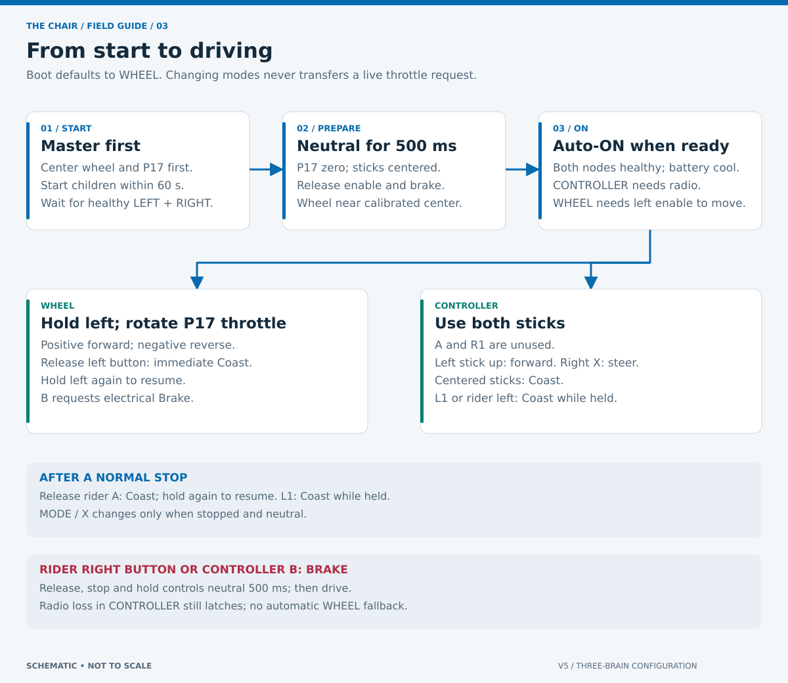

# Operator guide

For the club operator and rider. Complete [commissioning](COMMISSIONING.md) before running this procedure with a person aboard. The installed firmware starts in **WHEEL**, parked.

## Start and arm

1. In WHEEL mode, turn the P17 throttle to its physical zero. Release both wheel buttons and controller A/L1/B; center both sticks.
2. Start the master program in slot 1. Then manually start the LEFT and RIGHT programs in slots 2 and 3. Starting a Brain and starting its program are separate actions.
3. Each child handshakes first, then shows `INITIALIZING MOTORS`. P4–P7 must provide valid, cool telemetry continuously for 300 ms. Master cards show yellow `INIT` meanwhile and cannot become ready. `MISS`, `HOT` or `WARM` identifies why a motor is blocked. Current-related `F2`, `F4`, `F8` and combinations remain warnings; unknown bits block readiness. Then wait for healthy LEFT and RIGHT telemetry. A missing child keeps the chair parked; the master can wait indefinitely for a child started later.
4. Hold the wheel physically at its measured center, put the P17 throttle at its neutral detent, and tap **CENTER**. This zeros both steering and throttle positions; software cannot discover either physical zero.
5. Choose the mode while parked with **MODE** or controller **X**. CONTROLLER requires a connected controller. Mode selection itself does not require neutral because it cannot move the chair; it clears the arming gesture and starts a new neutral dwell.
6. Keep the controls neutral for at least **500 ms**, with the wheel near center, both nodes healthy and all temperatures below restart thresholds. Tap **ARM** or press controller **A**.
7. After arming: WHEEL requires holding ADI A; CONTROLLER needs no held button and responds directly to its sticks.

If ARM does nothing, use [the HUD troubleshooting guide](HUD.md#when-arm-does-nothing). Do not bypass an interlock.

## WHEEL mode

ADI C is unused and may remain empty. The Rotation Sensor on Smart Port 17 supplies signed WHEEL throttle. CENTER resets its current position to 0°; −8°…8° is neutral, +270° is full forward and −270° is full reverse. Each nonzero request rounds away from zero to the next 10% step; for example, 43% becomes 50% and −43% becomes −50%. Any finite position beyond full travel clamps to ±100% rather than faulting. A missing sensor, failed read or nonfinite value still latches `INPUT FAULT`. Verify both directions and usable travel unloaded before driving.

The **left button, ADI A**, is a hold-to-run control. The **right button, ADI B**, latches E-stop immediately in every state, including startup. In this chair's installed wiring, both read LOW when released and HIGH when pressed; the firmware follows those observed Device Viewer levels.

Physical ADI inputs are configured before Smart Port startup and use the raw state shown by VEXos Device Viewer. On this chair, released A/B buttons read LOW; pressed buttons read HIGH. The HUD displays current levels as `A:L B:L` when released. STARTUP has no motion authority, but ADI-B HIGH and controller B still latch and propagate E-stop immediately. ADI-B HIGH blocks CENTER/ARM; controller B is a separate remote E-stop. MODE and local CENTER calibration remain available while motors initialize; ARM still requires full readiness.

After arming, hold left, then rotate P17 gradually: positive for forward, negative for reverse. Pass through neutral before changing direction; software decelerates to zero before applying opposite voltage. Release left to coast while remaining armed; press it again to resume. Use PARK to coast and disarm.

## CONTROLLER mode

The V5 controller pairs to the **master** radio on P18. VEXos handles the radio; no generic serial device is created on that port. Optional controller absence does not block WHEEL mode. There is no auto-switch when a controller appears.

| Input | Action |
| --- | --- |
| Left stick Y | Forward when up, reverse when down |
| Right stick X | Arcade steering; with left Y centered, turns in place |
| A | Press once to arm; holding is unnecessary |
| R1 | Unused |
| L1 | Coast/disarm in either mode when controller is connected |
| B | Latched remote E-stop in either mode |
| X | Select mode while parked; if armed, parks first |
| Rider ADI A | Coast/disarm in controller mode |
| Rider ADI B | Latched E-stop, always |

Controller stick deadband is 8%. Loss of controller connection/state in CONTROLLER mode latches a fault and does not fall back to wheel input. Controller state freshness is limited by VEXos's connection detection; the API supplies no independent radio packet timestamp.

The wheel follows controller steering only while armed, with a 360°/s target slew limit, 1.2 V cap and 0.4 A current limit. Drive mixing responds to controller steering on the first control tick. A blocked servo remains current/voltage limited and does not fault solely because it cannot reach its target. The rider's two buttons remain effective. The entire master assembly must stay connected; removing it leaves children with no authorized control path and they stop.

## Stop, park and change drivers

| Situation | Action | What happens next |
| --- | --- | --- |
| Normal stop in WHEEL | Release the left wheel button | Coasts; remains armed and can resume when held again |
| Normal stop in CONTROLLER | Center left Y and right X | Coasts; remains armed and moves again when either stick requests motion |
| Disarm in CONTROLLER | Press L1 or the rider's left button | Coasts and parks; neutral and ARM required again |
| Stop through the display | Tap PARK | Coasts and disarms |
| Neutral drive request | P17 at zero or both controller sticks centered | Drive coasts; remains armed with steering feedback; increasing throttle or turn can resume |
| Rider feels unsafe | Press the right wheel button, ADI B | Software E-stop latches in either mode |
| Remote operator needs E-stop | Press controller B | Software E-stop latches in either mode while connected |
| Change mode while armed | Press MODE / X | Parks first; repeat mode selection once stopped and neutral |
| Switch to a different driver | PARK, release controls, then follow the arming sequence | No automatic takeover |

A latched fault cannot be cleared with ARM or by releasing the stop button. Note the displayed reason, fix it, and restart **all three programs**. Check temperatures again before arming. Cooling or reconnecting alone never clears a latch.

## Demonstration envelope

WHEEL mode supports forward and reverse from signed P17 rotation and permits an in-place turn at zero throttle. Full physical-wheel steering requests full equal/opposite side power. CONTROLLER mode uses signed arcade control and permits an in-place turn with left Y centered. P17 does not affect controller driving. Top side magnitude is 200 motor RPM at 12 V, approximately 3.57 mph **if the assumed wheel diameter and gearing are correct**. Do not treat the HUD estimate as a measured ground-speed limit.

The duty budget allows 120 seconds of accumulated commanded/measured movement unless there is a full 60-second rest. A brief coast does not restore the budget. Stop for a full rest before it expires; expiry latches a duty fault.

Keep the master and its rider buttons connected in both modes. Removing the steering-wheel assembly removes the driving authority; two-Brain operation is not supported. See [wiring and power](WIRING.md) and [stop behavior](SAFETY.md).
