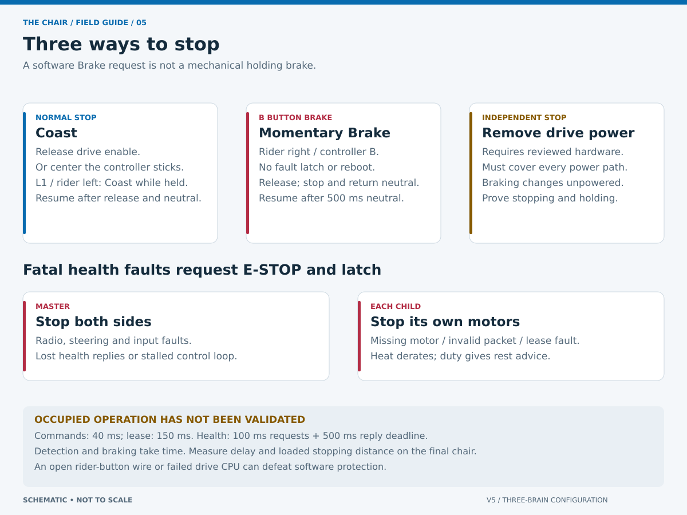
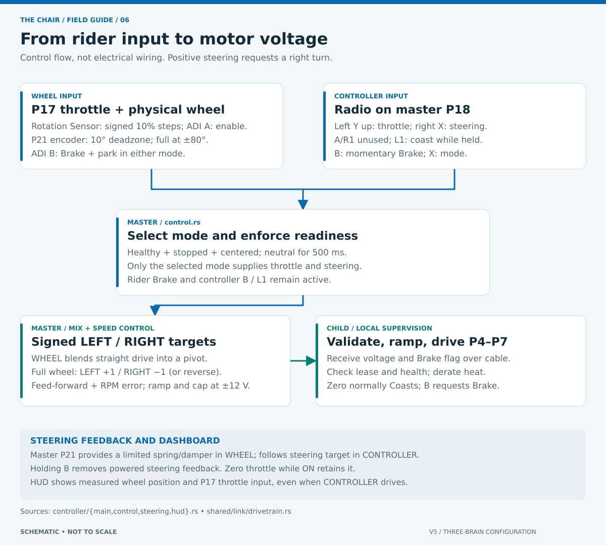
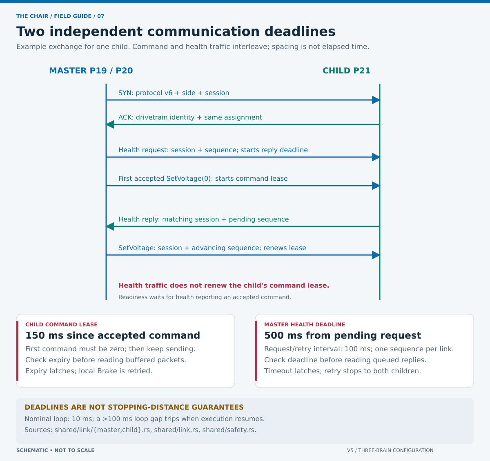
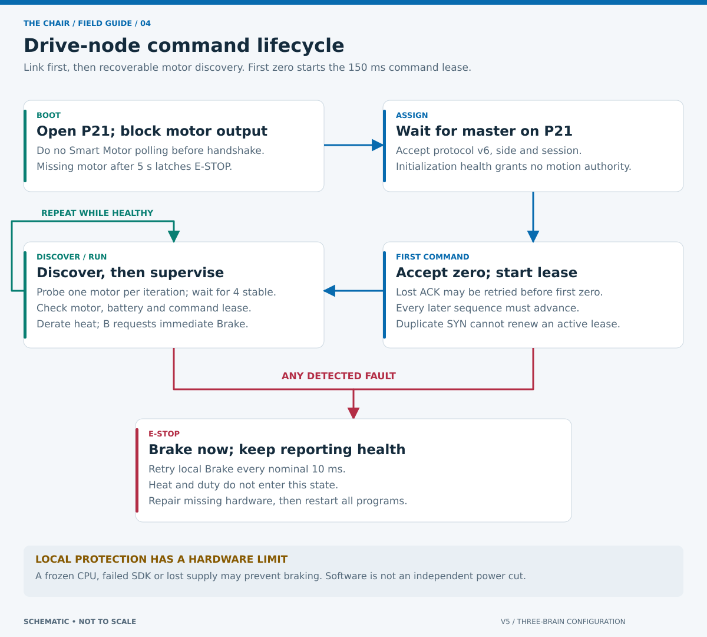

# Software design and stop behavior

The master selects a driving request; each child independently decides whether that request may reach its four motors. A locally faulted child may complete identification and send health so the master can display the fault, but its fault remains latched and it rejects every drive command. The display is diagnostic and is not required to press the rider stop buttons.

## Limits and ownership

| Check | Current setting | Enforced by |
| --- | --- | --- |
| Normal speed request | Up to 200 motor RPM per side | Master |
| Drive output | −12–12 V; P17 reverse in WHEEL only | Master and each child |
| Drive current limit | 2.5 A per motor; current-limit flags remain diagnostic | Each child / VEXos |
| Voltage ramp | 12 V/s up/down; zero bypasses ramp | Master and each child |
| Motor temperature | Trip ≥50°C; start/arm ≤40°C | Local supervision and master |
| Drive battery temperature | Trip ≥45°C; start/arm <38°C | Each child and master |
| Locally attached drive battery validity | All auxiliary fields zero with zero or valid 11–15 V means no local pack; otherwise 11–15 V, 20–100% capacity, absolute current ≤12 A and temperature ≥−10°C | Each child; master battery is not part of link health |
| Cumulative duty | 120 s; reset by a full 60 s rest | Master and each child |
| Nominal control interval | 10 ms | All programs |
| Loop-stall trip | Gap >100 ms; handled when execution resumes | All programs |
| Command send / active lease | 40 ms / 150 ms | Master / each child |
| Health requests / deadline | 100 ms / 500 ms | Master |
| Steering output | 1.2 V / 0.4 A; target slew 360°/s | Master |

Source of limits: `crates/shared/src/safety.rs`, `crates/shared/src/link/health.rs` and `crates/controller/src/steering.rs`. Values are conservative demonstration settings, not measured stopping-distance guarantees.

Master motion authority is represented by one explicit state: `STARTUP`, `PARKED`, `ARMED` or `FAULT(reason)`. `STARTUP` always commands zero, while either rider/controller E-stop still latches `FAULT` and propagates to connected children immediately; only the first reason is retained. It advances only after both nodes are healthy, motors are stopped, field control permits driving, and stop buttons are released. Neutral timing belongs to `PARKED`; releasing drive-enable coasts while retaining `ARMED`. Raw ADI input owns no latch or startup timer.

Arming requires valid health, each drive motor below 5 RPM, neutral controls for 500 ms, calibration and steering within 8% of center. These encoder checks do not prove the chair is physically stationary. After its P21 handshake and first zero command, each child stays in motor discovery as long as needed. It probes one Smart Motor per control iteration, repeatedly requests Brake and configuration, and requires all four motors to report valid telemetry without fatal faults at or below 45°C continuously for 300 ms. Missing or transient startup motor readings remain parked, grant no motion authority and can recover after reconnecting without restarting. A Brain without a local pack may report either all-zero battery telemetry or valid voltage with current, capacity and temperature all zero; both display as `NO PACK`. Invalid voltage and other partly populated tuples remain battery faults. The master Brain's own battery is not checked. A reported battery fault or prior software stop remains immediate.

## What a stop does

A normal operator stop coasts, except that zero throttle while drive enable stays held coasts without disarming. A latched fault retains its first reason, requests Brake and prevents further driving until restart. Both drive sides receive fault-stop requests; each child also faults locally.

Drive motors receive **Coast** for ordinary zero throttle, enable release, PARK or disarm. Latched faults receive electrical **Brake**. Either kind of stop removes steering feedback when disarmed; zero throttle while still armed does **not** remove steering feedback. Faulted children keep answering health and retrying local Brake. The master retries fault-stop messages to both children every 50 ms. The panic hook attempts local motor Brake before diagnostics; it is not a hardware watchdog.

A local fault can stop one side before the master detects it and stops the other. Communication deadlines and scheduling add delay. Test the resulting yaw and stopping distance with the final load.

## Speed and steering

WHEEL quantizes signed P17 throttle upward in 10% steps, then blends straight drive into an in-place pivot: `straight = throttle * (1 - abs(turn))`, `left = straight + turn`, `right = straight - turn`. Steering therefore works at zero throttle, and full steering always requests equal/opposite 200 RPM side targets at full power. CONTROLLER ignores P17 and uses signed arcade mixing: `left = throttle + turn`, `right = throttle - turn`. Left stick Y therefore drives forward/reverse; right stick X turns and can command equal/opposite sides at zero throttle. A presses once to arm and no enable button must remain held. Physical-wheel steering has a 10° deadzone and linear response to the ±80° endpoints, reducing near-center sensitivity. Controller steering enters the drive mix immediately. Controller proportional desaturation preserves the left/right ratio and keeps either side at or below 200 requested motor RPM magnitude. Voltage combines green-cartridge feed-forward with strong proportional RPM-error correction below full scale, allowing a loaded or stalled side to request substantially more launch voltage. At exactly 100% target the request is always 12 V; finite RPM cannot reduce it. A stopped drivetrain retains a 1.2 V minimum for tiny nonzero targets. Master and children each apply 12 V/s acceleration and reduction limits. A zero request bypasses ramps and commands Coast. A direction change must ramp to zero first; reverse acceleration begins on a later control tick.

Estimated MPH includes the documented external 72:48 gears: `motor_rpm × (72/48) × π × 4 / 1056`. Full 200 RPM target is approximately 3.57 mph. This is an encoder estimate, not verified ground speed. Individual motor RPM remains logged and feeds speed control, but no finite RPM value causes a fault.

Steering assumes a blue cartridge, reversed motor/sensor direction, encoder-to-wheel ratio 1:1 and ±80° physical travel from a manually set center. This makes physical right positive after the installed gear train reports raw right rotation as negative. These are commissioning parameters in `crates/controller/src/geometry.rs` and `crates/controller/src/steering.rs`. Resistive feedback is a limited spring/damper, active only when armed. The old repeated near-center encoder resetting is removed. Position beyond nominal travel clamps the input. Raw encoder velocity is logged and bounded before damping because VEXos can emit single-sample spikes while the motor is back-driven; neither condition alone latches a fault. One to four consecutive invalid samples coast steering feedback and log warnings; a valid sample recovers it, while the fifth consecutive invalid sample latches. Current-related `F2`, `F4`, `F8`, finite measured current and physical obstruction remain diagnostic only because the 0.4 A and 1.2 V limits constrain the motor. Unknown fault bits, overtemperature and failed output commands still latch. Park/E-stop removes powered feedback and coasts the steering motor; the wheel does not fight the rider after stopping.

## Link supervision

Links use 115,200 baud, Postcard encoding, CRC-32 and COBS delimiters. Version 5 direction-tags frames and includes the revised stop-reason encoding; it is incompatible with old firmware, so update all three programs together. Assignment includes protocol version, side and master session. Increasing command sequences reject duplicates, stale sequence order and wrong sessions. The command lease begins only after the mandatory first zero command; until then, a lost handshake ACK may be retried while the child remains braked. Session IDs are boot-time identifiers, not cryptographic authentication.

No health deadline starts until both children ACK and both zero-command transmissions succeed. The master clears residual startup traffic at that barrier. Commands are normally sent every 40 ms; the child retains a 150 ms lease, so loss of the master still stops locally. Health requests occur every 100 ms with a 500 ms reply deadline. While one is pending, the master stays silent except for emergency stopping, preventing a drive command from colliding with the health response on half-duplex Smart Port serial. It retries the same session/sequence every 100 ms without extending the deadline. Replies must echo that sequence/session. Protocol v5 direction-tags request and response frames so V5 generic-serial self-echo is recognized and discarded rather than reported as corruption. CRC/COBS-invalid and oversized UART frames are counted, discarded through their delimiter and resynchronized; a single damaged frame cannot latch a protocol fault. Validly decoded packets with a wrong role, assignment, session, sequence or request remain fatal. A child opened while the master is transmitting may first receive a partial frame, which is discarded while the child remains braked and has no command lease. Transient TX/RX backpressure is retried, while failure to send commands or receive valid health for the full deadline latches stopping. Duplicate handshakes cannot renew a lease. Each poll has a packet and byte budget to prevent serial traffic starving stop checks.

Children prioritize P21 link servicing before Smart Motor access. Before the first accepted zero command they do no battery or motor polling. Because the master withholds zero until both ACK, neither child begins health work early. During discovery they probe one motor per iteration; missing or transient motor fault readings report `initializing` rather than granting readiness or latching, and motor output remains blocked. After all four stabilize, children read full motor/battery health every loop. Runtime motor faults then stop locally without waiting for master telemetry polls. Faulted nodes keep servicing health and retrying Brake every 10 ms. The master retries E-stop on both links every 50 ms, independently. Master and child screen drawing runs in separate cooperative async tasks; safety loops exchange copied snapshots with them and never wait for a render. Command loss and health loss therefore have different worst-case delays; neither is instantaneous or a certified stopping-distance guarantee.

## Protection boundaries

- Ordinary bumper wiring is not a monitored E-stop circuit. An open right-button wire can appear released. ADI C is unused; P17 Rotation Sensor disconnection faults its telemetry read.
- A frozen CPU, failed SDK or motor controller, exception failure, or loss of power can defeat software braking. A peer cannot electrically disconnect another Brain's motors.
- Controller freshness depends on VEXos connection detection; the API exposes no independent radio packet timestamp.
- Normal stops deliberately Coast and therefore take longer than electrical braking. Fault stops request Brake, but it is not a mechanical parking brake and VEXos field-disabled behavior can force coast.
- CRC and sessions reject accidental corruption and stale traffic; they are not authentication.
- Restarting programs resets software state and counters. It does not cool motors, repair wiring or validate the shared supply.

Follow the [unloaded fault tests and power/braking checks](COMMISSIONING.md) before occupied use.
