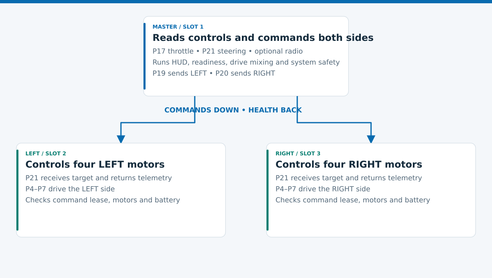
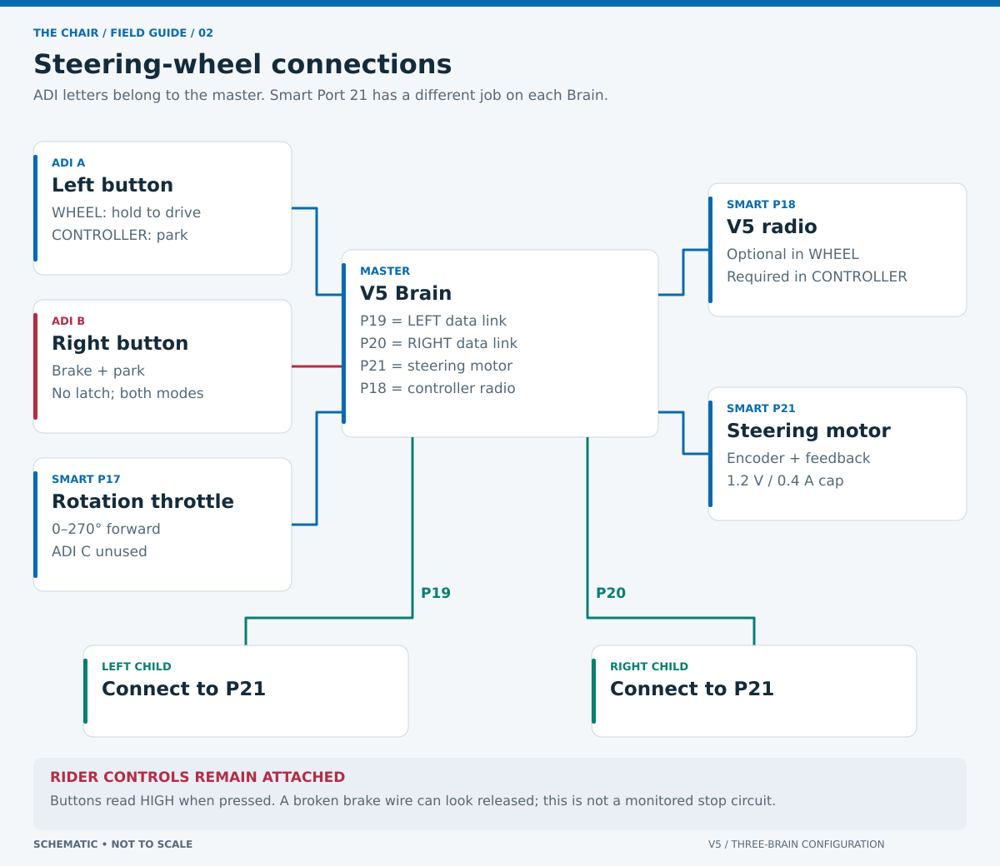

# Wiring and hardware assumptions

This is the finalized **three VEX V5 Brain** configuration. The photographs establish the arrangement of the chair and steering assembly; they do not establish gear ratio, motor polarity, safe steering travel or battery compatibility.

## Cable schedule

| From | To | Purpose |
| --- | --- | --- |
| Master P19 | LEFT P21 | LEFT commands and health |
| Master P20 | RIGHT P21 | RIGHT commands and health |
| Master P21 | Steering motor | Wheel encoder and resistive / follow feedback |
| Master P18 | V5 radio | Optional controller connection |
| Master P17 | Rotation Sensor | WHEEL forward speed request, 0–270° |
| Master ADI A | Left wheel bumper | WHEEL hold-to-run; CONTROLLER rider brake |
| Master ADI B | Right wheel bumper | Latched rider E-stop in both modes |
| Master ADI C | Unused | Leave empty; broken potentiometer removed |
| LEFT P4, P5 | Two bottom LEFT drive motors | LEFT base polarity |
| LEFT P6, P7 | Two top LEFT drive motors | Opposite polarity from LEFT bottom pair |
| RIGHT P4, P5 | Two bottom RIGHT drive motors | Mirrored RIGHT base polarity |
| RIGHT P6, P7 | Two top RIGHT drive motors | Opposite polarity from RIGHT bottom pair |

**P21 is role-dependent:** on the master it is a motor port; on either child it is the serial uplink. Do not connect the child link to master P21.

## Firmware identity

| Brain | Image | Upload slot | Runtime identity |
| --- | --- | --- | --- |
| Steering-wheel master | `chair-controller` | 1 | Coordinator |
| LEFT drive Brain | `chair-left` | 2 | Assigned by master P19 |
| RIGHT drive Brain | `chair-right` | 3 | Assigned by master P20 |

The child packages call the same shared `run_node`. Slot names aid uploading; they do not assign the side. The master assigns side and session from its cable port. That assignment cannot change during the live session.

Children have no local throttle, mode selector or rider controls. They retain the state needed for local safety: command sequence, deadline, fault latch and duty budget.

## Parameters still requiring measurement

| Item | Current software assumption | Verify before driving |
| --- | --- | --- |
| Drive cartridges | Green, 200 RPM | All eight cartridges |
| Motor direction | LEFT P4/P5 Reverse, P6/P7 Forward; RIGHT P4/P5 Forward, P6/P7 Reverse | Every motor propels its side physically forward |
| Drive wheel diameter | 4 inches | Actual loaded rolling circumference |
| External drive ratio | 72:48; wheel turns 1.5 times per motor turn | Complete gear train and ratio direction |
| Steering cartridge / direction | Blue / Reverse | Installed cartridge; physical right matches HUD right |
| Encoder / wheel rotation | 1:1 | Full steering gear train |
| Steering travel | ±80° from manual center; 10° control deadzone | Mechanical stops, cables and hand clearance |
| P17 throttle travel | 0° neutral, +270° forward, −270° reverse; ±8° neutral band | Both directions and installed mechanical travel |

These are configuration values, not findings from the photos. Calibration locations and the speed calculation are in [software design](SAFETY.md#speed-and-steering); record measurements in [commissioning](COMMISSIONING.md).

## Power and startup

The owner reports one battery on each drive Brain, with Smart Cables powering the master. One connected pack can reportedly back-power all three Brains. This is an observation, **not approval of a shared two-battery supply**.

Firmware cannot isolate the batteries, disconnect this shared supply, or prove that a Brain is unpowered. Removing one pack may leave the chain powered. Have the actual wiring and an independent all-drive power cut reviewed before occupied operation.

Start the master program first, then start each child manually. Software can withhold motion authority but cannot enforce electrical power-on order or start another Brain's program. Each child handshakes on P21 first, then waits as long as needed for P4–P7 to enumerate and configure while motion remains blocked; all four must be stable for 300 ms. An early child waits braked. Removing the master during an active session causes child command-timeout stopping; it does not create a two-node controller mode.
